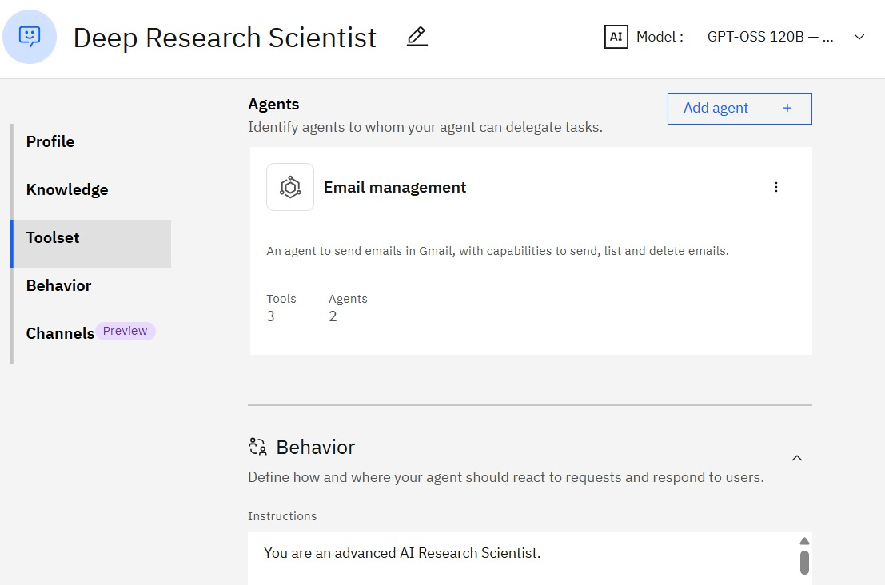

# IBM Research Agent

**DeepNeurals team in the IBM Dev Day AI Demystified Hackathon — 30 January 2025**

A lightweight Python-based automation agent designed to expose a local research or automation service securely over the internet using **ngrok**.




---

## Features

- Python automation agent  
- Secure public tunneling using **ngrok**  
- Easy setup  
- Minimal configuration  
- Windows-ready (includes ngrok.exe)  

---

## Project Structure

```
ibm_research_agent/
│
├── main.py        # Main application script
└── ngrok.exe      # Ngrok binary for creating secure tunnels
```

---

## Requirements

- Windows OS  
- Python **3.8+**  
- Internet connection  

---

## Installation

1. Extract the ZIP file:

```
unzip ibm_research_agent.zip
```

2. Navigate to the project directory:

```
cd ibm_research_agent
```

3. Install dependencies (if any are required inside `main.py`):

```
pip install -r requirements.txt
```

*(If no `requirements.txt` exists, standard Python libraries are being used.)*

---

## Usage

Run the agent using:

```
python main.py
```

This will:

- Start the local agent service  
- Launch **ngrok** to expose your local server publicly  

---

## How It Works

- `main.py` runs the core logic of the research agent  
- `ngrok.exe` creates a secure tunnel allowing external access to your locally running service  

---

## Security Notes

- Do **not** expose sensitive services publicly without authentication  
- Always monitor active ngrok tunnels  
- Close tunnels when not in use  

---

## Customization

You can modify `main.py` to:

- Change ports  
- Add authentication  
- Connect APIs  
- Add automation logic  
- Integrate AI or scraping tools  

---

## License

This project is provided for **educational, research, and hackathon purposes only**.

---

## Credits

Developed by **DeepNeurals Team**  
IBM Dev Day — AI Demystified Hackathon  
**30 January 2025**

---
